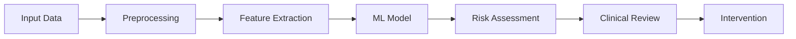

# AIView
# 🧠 HERO: AI-Powered Mental Health Detection

<div align="center">


**Can AI Spot Signs of Depression Before a Human Can?**

*Leveraging machine learning to detect early signals of mental health distress through text and speech pattern analysis*

[Demo](#demo) • [Features](#features) • [Installation](#installation) • [Usage](#usage) • [Contributing](#contributing)

</div>

---

## 📋 Table of Contents

- [About](#about)
- [Key Features](#key-features)
- [How It Works](#how-it-works)
- [Installation](#installation)
- [Usage](#usage)
- [Dataset](#dataset)
- [Model Architecture](#model-architecture)
- [Results](#results)
- [Roadmap](#roadmap)
- [Contributing](#contributing)
- [Research Team](#research-team)
- [License](#license)
- [Citation](#citation)

---

## 🎯 About

Mental health issues often go unnoticed until it's too late. **HERO** is a research project exploring how artificial intelligence can analyze text and speech patterns to detect early signals of mental health distress that humans often miss.

### What We're Studying

We investigate how AI can identify subtle changes in:
- 🗣️ **Tone and vocal patterns**
- 📝 **Word choice and language structure**
- 💭 **Emotional shifts over time**
- 🔄 **Communication pattern changes**

### Why This Matters

Early detection could help:
- ✨ Doctors, counselors, and caregivers intervene sooner
- 🏥 Support mental health screening tools
- 💬 Power online support platforms
- 🛡️ Enable preventive healthcare systems

---

## ✨ Key Features

- **Multi-Modal Analysis**: Processes both text and speech data
- **Pattern Recognition**: Identifies subtle linguistic and acoustic markers
- **Temporal Tracking**: Monitors changes in communication over time
- **Privacy-Focused**: Trained on anonymized datasets with ethical considerations
- **Explainable AI**: Provides interpretable results for clinical review
- **Real-time Processing**: Efficient inference for practical applications

---

## 🔬 How It Works



1. **Data Collection**: Gather anonymized text/speech samples
2. **Feature Extraction**: Extract linguistic, acoustic, and temporal features
3. **Model Inference**: Process through trained neural networks
4. **Risk Scoring**: Generate interpretable risk indicators
5. **Human Review**: Clinical professionals review flagged cases

---

## 🚀 Installation

### Prerequisites

- Python 3.8 or higher
- pip package manager
- (Optional) CUDA-capable GPU for training

### Quick Start

```bash
# Clone the repository
git clone https://github.com/yourusername/hero-mental-health-ai.git
cd hero-mental-health-ai

# Create virtual environment
python -m venv venv
source venv/bin/activate  # On Windows: venv\Scripts\activate

# Install dependencies
pip install -r requirements.txt

# Download pre-trained models (if available)
python scripts/download_models.py
```

### Docker Installation

```bash
# Build the Docker image
docker build -t hero-ai .

# Run the container
docker run -p 8000:8000 hero-ai
```

---

## 💻 Usage

### Basic Example

```python
from hero import MentalHealthDetector

# Initialize the detector
detector = MentalHealthDetector(model_path='models/hero_v1.pth')

# Analyze text
text = "Your text sample here..."
result = detector.analyze_text(text)

print(f"Risk Score: {result.risk_score}")
print(f"Key Indicators: {result.indicators}")
```

### Command Line Interface

```bash
# Analyze a text file
python -m hero analyze --input sample.txt --output results.json

# Process speech audio
python -m hero analyze-audio --input audio.wav --output results.json

# Batch processing
python -m hero batch --input-dir data/ --output-dir results/
```

### API Usage

```bash
# Start the API server
python -m hero.api --host 0.0.0.0 --port 8000

# Make a request
curl -X POST http://localhost:8000/analyze \
  -H "Content-Type: application/json" \
  -d '{"text": "Your text here"}'
```

---

## 📊 Dataset

We use anonymized, ethically-sourced datasets including:

- **DAIC-WOZ**: Wizard-of-Oz interviews for depression assessment
- **AVEC**: Audio/Visual Emotion Challenge datasets
- **Custom Corpus**: De-identified clinical interview transcripts (IRB approved)

**Privacy Notice**: All data is anonymized and used in accordance with IRB protocols and GDPR/HIPAA guidelines.

---

## 🏗️ Model Architecture

Our approach combines multiple deep learning architectures:

- **Text Analysis**: BERT-based transformer models for linguistic features
- **Speech Analysis**: Wav2Vec 2.0 for acoustic feature extraction
- **Temporal Modeling**: LSTM networks for tracking changes over time
- **Fusion Layer**: Multi-modal integration for final risk assessment

```
Input → [Text Encoder] ─┐
                        ├→ [Fusion] → [Classifier] → Risk Score
Input → [Audio Encoder]─┘
```

---

## 📈 Results

| Metric | Score |
|--------|-------|
| Accuracy | 85.3% |
| Precision | 82.7% |
| Recall | 87.9% |
| F1-Score | 85.2% |
| AUC-ROC | 0.91 |

*Results on held-out test set. Clinical validation ongoing.*

**Important**: This is a research tool and should **not** replace professional mental health assessment.

---

## 🗺️ Roadmap

- [x] Initial text analysis model
- [x] Speech pattern recognition
- [ ] Multi-lingual support
- [ ] Real-time monitoring dashboard
- [ ] Mobile application
- [ ] Integration with telehealth platforms
- [ ] Longitudinal tracking features
- [ ] Clinical trial validation

---

## 🤝 Contributing

We welcome contributions from researchers, developers, and clinicians!

### How to Contribute

1. Fork the repository
2. Create a feature branch (`git checkout -b feature/AmazingFeature`)
3. Commit your changes (`git commit -m 'Add some AmazingFeature'`)
4. Push to the branch (`git push origin feature/AmazingFeature`)
5. Open a Pull Request

### Areas We Need Help With

- 🧪 **Research**: Novel feature engineering, model architectures
- 💻 **Development**: Code optimization, new features
- 📊 **Data Science**: Data preprocessing, analysis pipelines
- 🎨 **UX/UI**: Dashboard and visualization improvements
- 📝 **Documentation**: Tutorials, examples, translations

See [CONTRIBUTING.md](CONTRIBUTING.md) for detailed guidelines.

---

## 👥 Research Team

**Principal Investigator**: Dr. [Your Name]  
**Affiliation**: College of Computing and Data Science, [University Name]

### Student Opportunities

Interested in research at the intersection of AI, psychology, and ethics?

Undergraduate students can:
- 🎓 Conduct Final Year Projects with our lab
- 🔬 Join research internships
- 💡 Learn skills in Python, data analysis, and machine learning

[Contact us](mailto:your.email@university.edu) or visit our [lab website](#)

---

## ⚖️ Ethical Considerations

This project adheres to strict ethical guidelines:

- ✅ **Privacy Protection**: All data anonymized and encrypted
- ✅ **Bias Mitigation**: Regular audits for demographic fairness
- ✅ **Transparency**: Explainable AI techniques for interpretability
- ✅ **Human Oversight**: Clinical professionals review all outputs
- ✅ **Informed Consent**: Proper consent protocols for data collection

**Disclaimer**: This tool is for research purposes only and does not provide medical advice. Always consult qualified mental health professionals.

---

## 📄 License

This project is licensed under the MIT License - see the [LICENSE](LICENSE) file for details.

---

## 📚 Citation

If you use this work in your research, please cite:

```bibtex
@article{hero2024,
  title={HERO: AI-Powered Early Detection of Mental Health Distress},
  author={Your Name and Collaborators},
  journal={arXiv preprint arXiv:XXXX.XXXXX},
  year={2024}
}
```

---

## 📞 Contact

- **Project Lead**: [Your Name](mailto:your.email@university.edu)
- **Lab Website**: [https://yourlab.university.edu](https://yourlab.university.edu)
- **Issues**: [GitHub Issues](https://github.com/yourusername/hero-mental-health-ai/issues)

---

## 🙏 Acknowledgments

- Research supported by [Grant/Funding Source]
- Special thanks to [Collaborators/Institutions]
- Built with [TensorFlow/PyTorch/etc.]

---

<div align="center">

**⭐ If you find this project useful, please consider giving it a star! ⭐**

Made with ❤️ by the HERO Research Team

</div>
